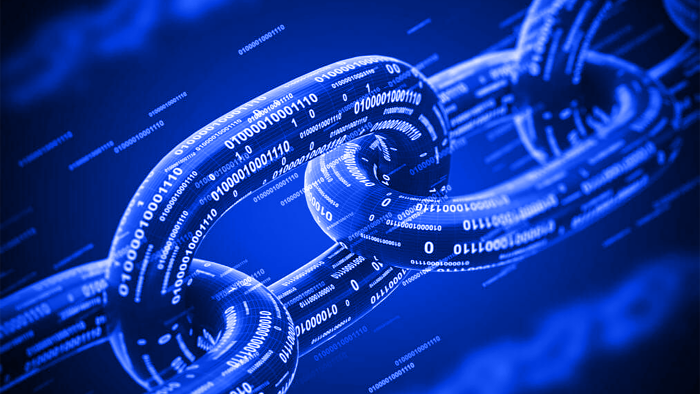

# What is Blockchain?

Blockchain is a decentralized, distributed ledger technology that enables secure and transparent transactions and data storage. It is often associated with cryptocurrencies such as Bitcoin and Ethereum, but it has applications in many other fields, including supply chain management, voting systems, and identity verification.

At its core, a blockchain is a digital ledger that records transactions in a secure and transparent way. Each transaction is recorded in a block, which is then added to the chain of previous blocks, creating a chain of information that cannot be altered or deleted. This makes it very difficult for anyone to tamper with the data or make fraudulent transactions.

One of the key features of blockchain is that it is decentralized, meaning there is no central authority or intermediary that controls the network. Instead, transactions are validated and recorded by a network of nodes or computers that work together to maintain the integrity of the blockchain.

In addition to being decentralized, blockchain is also highly secure. Each block in the chain is linked to the previous block using cryptography, making it virtually impossible to alter the data without being detected. Furthermore, because the blockchain is distributed across multiple nodes, there is no single point of failure or vulnerability.

Overall, blockchain technology has the potential to revolutionize the way we store and transfer data, enabling secure and transparent transactions without the need for intermediaries. It has numerous applications in finance, supply chain management, healthcare, and many other fields.
