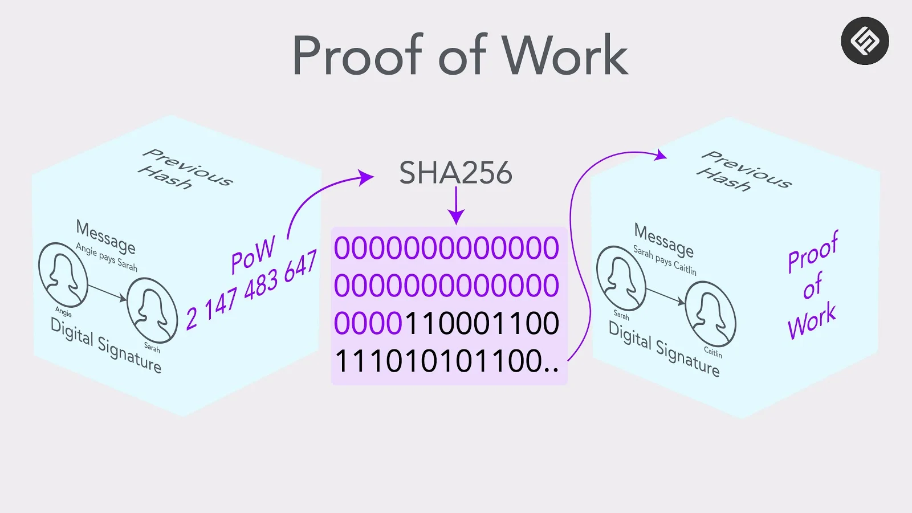

# What is Proof of Work?

Proof of Work (PoW) is a consensus mechanism used by some blockchain networks to validate transactions and create new blocks in the chain. It is the consensus mechanism used by Bitcoin, the first and most well-known cryptocurrency.

In a PoW system, validators, also known as "miners," compete to solve a complex mathematical puzzle in order to validate a block and add it to the chain. The first miner to solve the puzzle is rewarded with a certain amount of cryptocurrency, and the validated transactions are added to the blockchain.

The puzzle that miners must solve is intentionally difficult and requires a significant amount of computational power. This is designed to make it difficult for any one miner or group of miners to control the network and prevent fraudulent activity.

PoW is considered to be a secure consensus mechanism, as it is very difficult to alter the blockchain once a block has been added to the chain. However, it is also very energy-intensive, as the computational power required to validate blocks consumes a significant amount of electricity.

In recent years, there has been a growing interest in alternative consensus mechanisms, such as Proof of Stake (PoS), which is considered to be more energy-efficient. However, PoW remains the dominant consensus mechanism for many blockchain networks, including Bitcoin.
