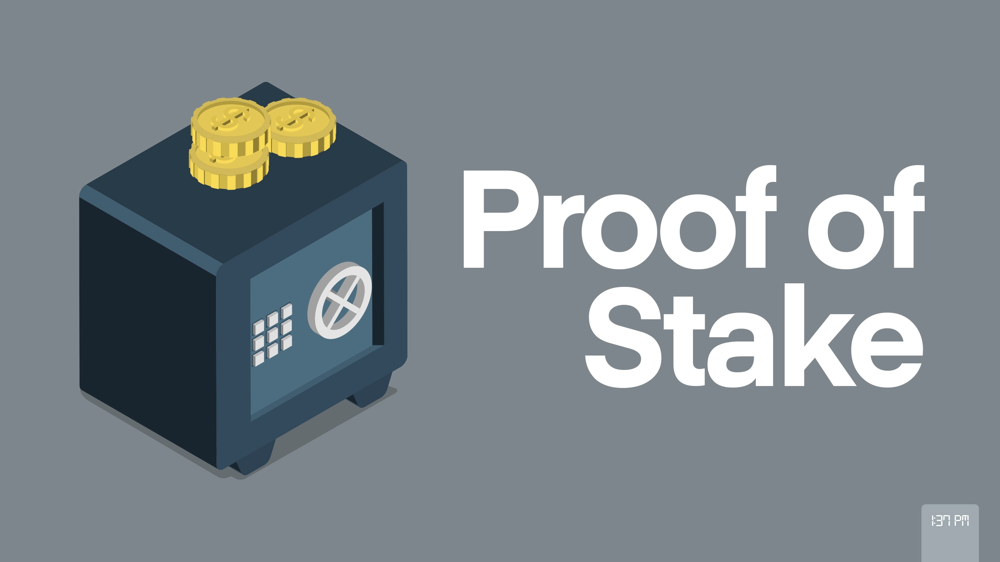
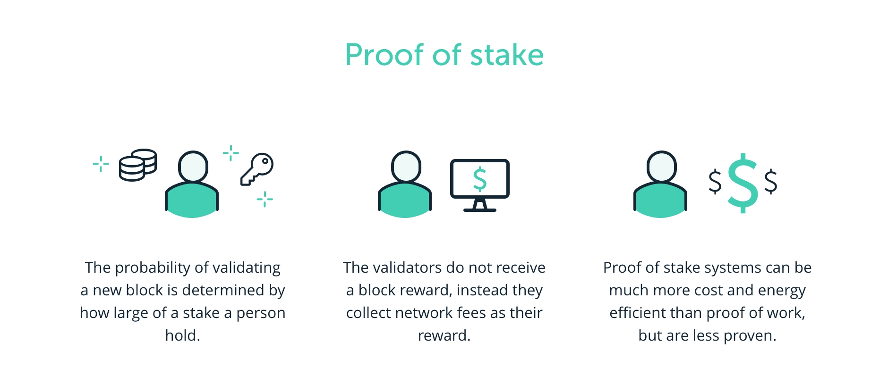

# What is Proof of Stake?

Proof of Stake (PoS) is a consensus mechanism used by some blockchain networks to validate transactions and create new blocks in the chain. It is an alternative to Proof of Work (PoW), which is the consensus mechanism used by Bitcoin.

In a PoS system, validators, also known as "stakers," are chosen to create new blocks based on the amount of cryptocurrency they hold, rather than their computational power as in PoW. Validators are required to "stake" a certain amount of cryptocurrency as collateral to participate in the validation process. The amount of cryptocurrency they stake determines their chances of being chosen to validate the next block.

When a validator is chosen to validate a block, they receive a reward in cryptocurrency for their work. However, if they are found to be dishonest or attempt to validate an invalid block, they will lose their staked cryptocurrency as a penalty.

PoS is considered to be more energy-efficient than PoW, as it does not require the high computational power and electricity consumption of PoW. It also has the potential to reduce centralization, as it allows for a wider range of participants to validate transactions and create new blocks.

Some popular blockchain networks that use PoS include Ethereum, Cardano, and Polkadot.
