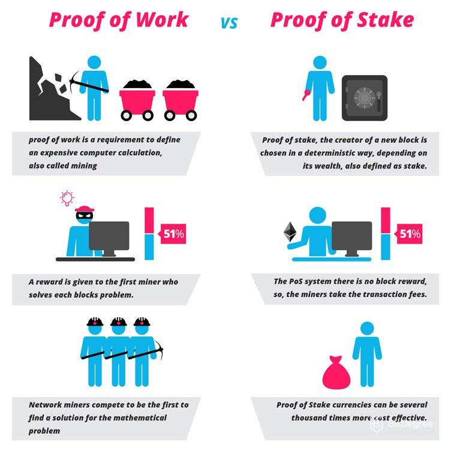
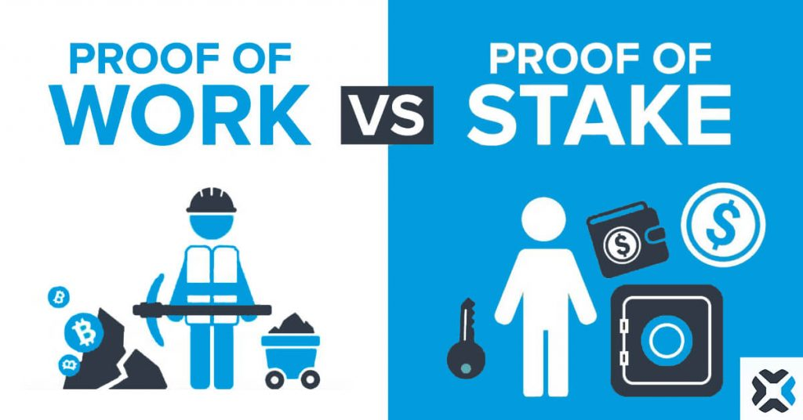

# Proof of Stake vs Proof of Work

Proof of Stake (PoS) and Proof of Work (PoW) are both consensus mechanisms used by blockchain networks to validate transactions and add new blocks to the chain. However, they differ in several key ways.

## Resource Requirements:
In a PoW system, validators (or miners) must invest significant amounts of computational power to solve a complex mathematical puzzle to validate a block. This requires a lot of energy and can be costly. In contrast, PoS validators (or stakers) invest cryptocurrency as collateral to participate in the validation process. The more cryptocurrency they hold, the greater their chances of being chosen to validate the next block.

## Security:

Both PoW and PoS are designed to ensure the security and integrity of the blockchain network. In PoW, miners compete to solve the mathematical puzzle, which makes it very difficult for anyone to alter the blockchain without being detected. In PoS, validators are incentivized to act honestly, as they stand to lose their staked cryptocurrency if they validate an invalid block.

## Decentralization:

One of the concerns with PoW is that it can lead to centralization, as large miners with significant computing power may dominate the network. PoS is designed to be more decentralized, as it enables a wider range of participants to validate transactions and add new blocks to the chain.

## Energy Efficiency:

PoW requires a significant amount of energy to validate transactions and add new blocks to the chain. This has led to concerns about its environmental impact. PoS is generally considered to be more energy-efficient, as it does not require the same level of computational power as PoW.

Overall, PoS is seen as a more energy-efficient and scalable alternative to PoW. However, PoW remains the dominant consensus mechanism for many blockchain networks, including Bitcoin, while other blockchain networks such as Ethereum are transitioning to PoS.
