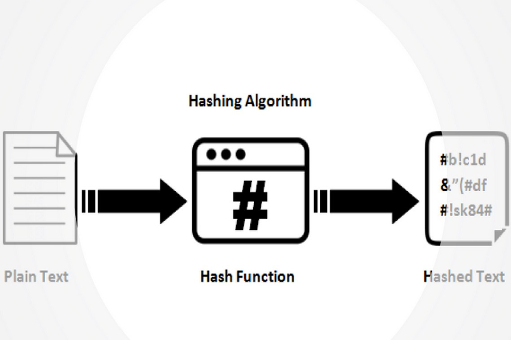

# Hash, Token, Block

Hash, token, and block are all important concepts in blockchain technology.

## Hash

A hash is a unique identifier for data stored on the blockchain. It is a string of letters and numbers generated by a hash function, which takes input data of any size and produces a fixed-size output. Hashes are used to ensure the integrity of the data on the blockchain, as any change to the data will result in a different hash value.

## Token

A token is a digital asset that is created and managed on a blockchain. Tokens can represent anything of value, such as currency, real estate, or even a vote in a governance system. Tokens are created through smart contracts, which are self-executing programs that run on the blockchain. Tokens can be transferred between users without the need for intermediaries, such as banks or brokers.

## Block

A block is a collection of data that is added to the blockchain. Each block contains a set of transactions, a timestamp, and a unique hash value. When a block is added to the blockchain, it is linked to the previous block through its hash value, creating a chain of blocks (hence the name "blockchain"). Blocks are validated by network participants, such as miners or validators, before they are added to the chain. Once a block is added to the chain, it cannot be altered or deleted, ensuring the integrity of the data on the blockchain.
