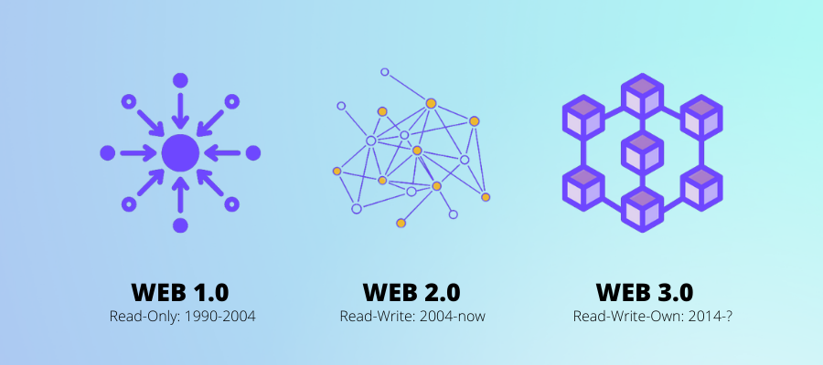
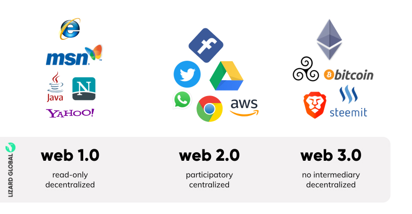

# What is WEB3?

Web3, also known as Web 3.0, is the next evolution of the internet that aims to create a decentralized web. It is a vision of a more open, transparent, and democratic internet where users have greater control over their data, privacy, and online identity.

Web3 is built on blockchain technology, which enables the creation of trustless, decentralized networks that are not controlled by any single entity. This technology allows for the creation of decentralized applications (dApps) that can run on peer-to-peer networks, without the need for a central server.

Web3 is also characterized by the use of decentralized protocols such as InterPlanetary File System (IPFS) and peer-to-peer networks like BitTorrent. These protocols enable the distribution and sharing of data in a decentralized way, ensuring that data remains secure and available even if some nodes in the network fail.

One of the key benefits of Web3 is that it enables the creation of digital assets that are truly owned by the user. In traditional web applications, users are often required to give up control of their data and assets to a central authority. In contrast, with Web3, users can own their digital assets, control their identity, and even participate in the governance of the network.

Overall, Web3 represents a significant shift in the way we think about the internet and its potential. With Web3, we can create a more equitable, decentralized, and user-centric web that is more resistant to censorship and control.
