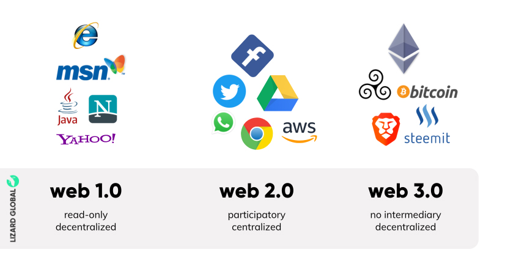

# ERAs of Web

There have been three major eras of the web, each characterized by a different set of technologies and use cases.

## Web 1.0: The static web era

The first era of the web, also known as Web 1.0, began in the late 1980s and lasted until the early 2000s. During this era, the internet was primarily used to share static web pages that contained text, images, and hyperlinks. Websites were designed using HTML and CSS, and there was little interactivity or user-generated content. E-commerce was in its infancy, and most businesses used the web as a way to provide information rather than to sell products or services.

## Web 2.0: The social web era

The second era of the web, Web 2.0, emerged in the mid-2000s and continues to this day. This era is characterized by the rise of social media platforms, user-generated content, and increased interactivity. Web 2.0 introduced technologies such as JavaScript, Ajax, and APIs that enabled the creation of dynamic web applications. Online communities and social networking sites like Facebook, Twitter, and LinkedIn became popular, and e-commerce experienced explosive growth.

## Web 3.0: The decentralized web era

The third era of the web, Web 3.0, also known as the decentralized web, is still emerging. This era is characterized by the use of blockchain technology and decentralized protocols to create a more open, transparent, and user-centric web. Web 3.0 promises to enable greater privacy, security, and ownership of digital assets. Decentralized applications (dApps) are being built on top of blockchain networks like Ethereum, and new protocols such as InterPlanetary File System (IPFS) and Web3.js are being developed to enable a more decentralized web.
