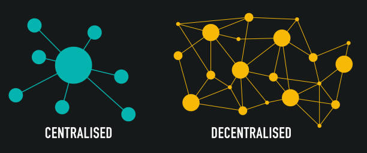
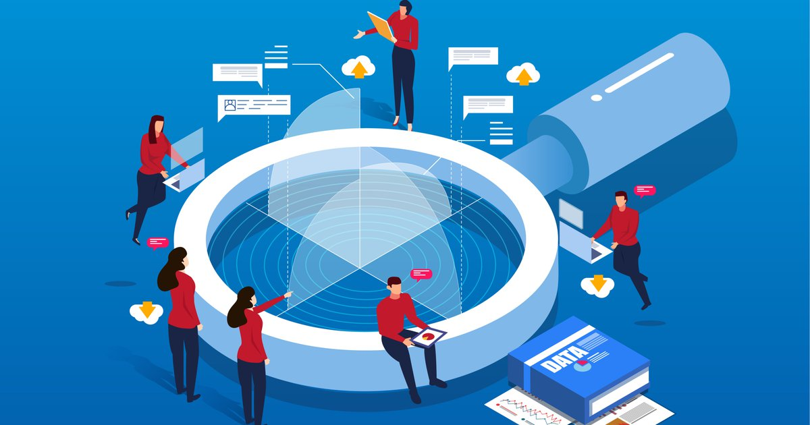

# Why we need Web 3.0?

Web 3.0, also known as the decentralized web, offers several advantages over the current web (Web 2.0) that we use today.

## Decentralization

Web 3.0 aims to create a more decentralized web, which means that no single entity can control the internet. This will increase the security and privacy of online activities and reduce the risk of censorship or data breaches.

## Ownership and control of data

With Web 3.0, users will have greater ownership and control of their data. Decentralized platforms will enable users to own and control their digital assets, identity, and data, which will help prevent companies from exploiting user data for their own gain.

## Trustless transactions

Web 3.0 will enable trustless transactions using blockchain technology, which eliminates the need for intermediaries like banks or payment processors. This will reduce transaction fees, increase transaction speeds, and enable micropayments for online services.

## Transparency

Decentralized networks are transparent, which means that anyone can access the network data and verify the integrity of the network. This will help prevent fraud and increase trust in online activities.

## Interoperability

Web 3.0 will enable different platforms to work together seamlessly, which will improve collaboration and innovation. This means that developers can build applications that can work across different platforms and networks.
